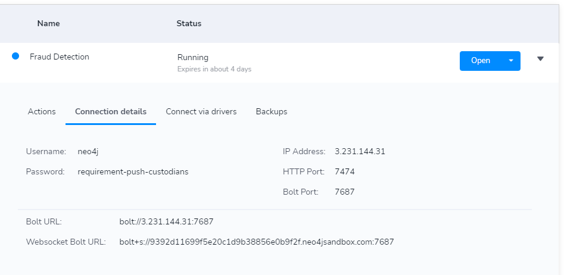
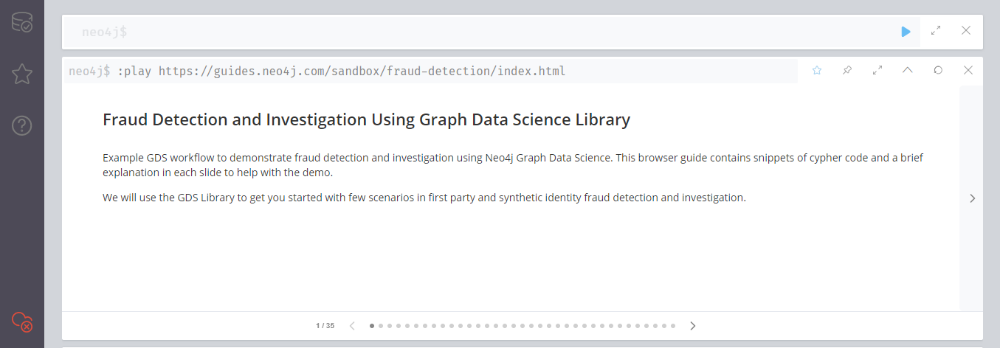
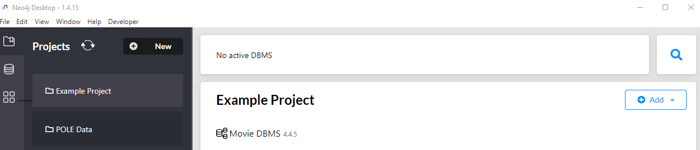
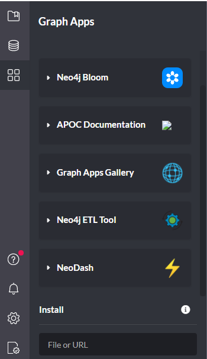
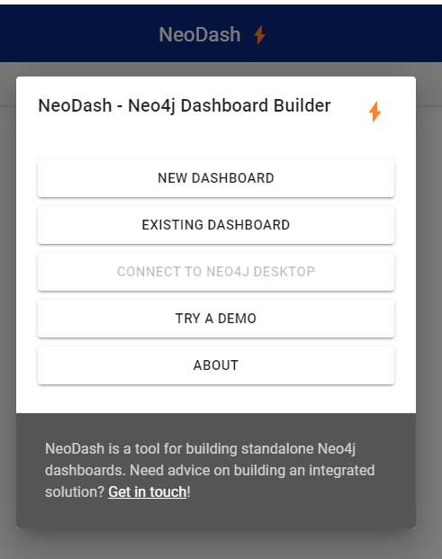
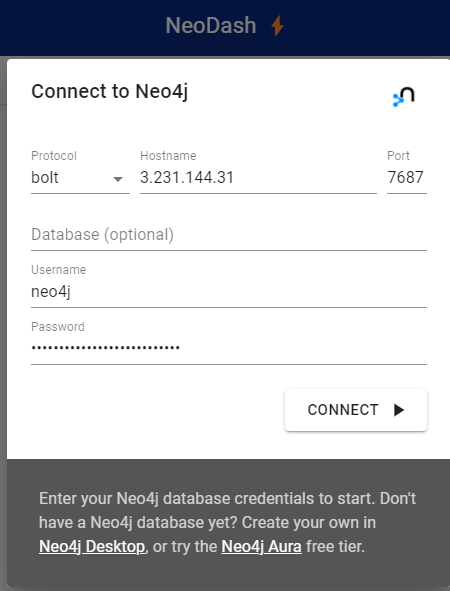
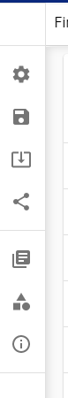
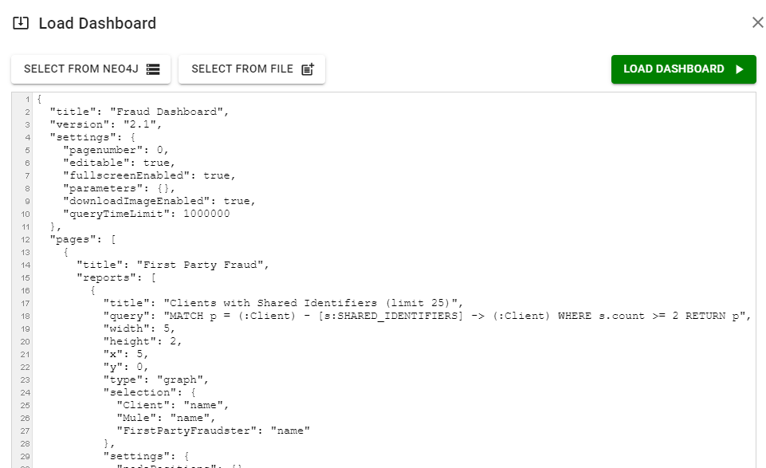
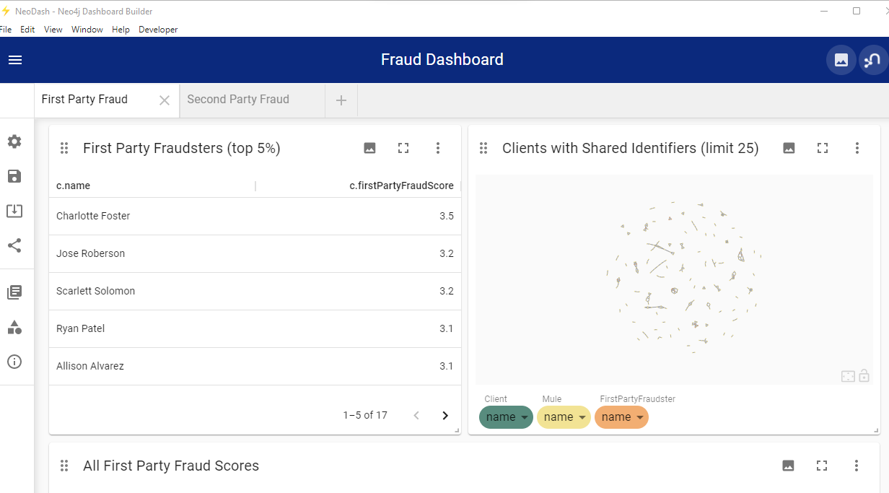

# Neo4J
#### Authored by Cody Taylor

## Introduction
Neo4j offers a suite of complementary tools to go along with their Neo4j browser. These tools are able to be used in conjunction with the main features of Neo4j to enhance analysis and exploration of the data. NeoDash is one such tool. NeoDash has also been used explicitly to complement fraud detection using Neo4j’s graph algorithms (See this [video](https://www.youtube.com/watch?v=j5fM7Qrgb0o)). 

The value of the dashboard is that it allows you to visualize many queries side-by-side in many different formats, such as tables, graphs, charts, etc. We use NeoDash to compare the results of our anomaly detection models with the labeled first- and second-party fraudsters or other suspicious individuals based on their fraud scores that are visualized in our dashboard. NeoDash allows for greater customization of the data visualization, for our dashboard we displayed the first party fraudsters (labeled so because they had the top 5% of first party fraud scores). We also chose to display all individuals who were assigned a first party fraud score based on their suspicious activity (shared identifiers), as well as clusters of fraud rings. For second party fraud, we chose to display the second party fraud scores as well as transactions between first party fraudsters and other clients. 

Although these are the visualizations we chose to display, there are many other options to customize the dashboard for your own personal taste. If you would like to integrate your python code into a similar dashboard however, you will need to use a tool other than NeoDash, as it only handles cypher query language. Options include Plotly Dash which can be integrated with Cytoscape and the Neo4j Python Driver.

## To recreate our neo4j dashboard...
1. Download the Neo4j Desktop application [here](https://www.bing.com/search?q=neo4j+destkop+download&cvid=9da7153b72e94f02bfa1e57122b1563a&aqs=edge..69i57j0l2j69i64.7057j0j1&pglt=43&FORM=ANNTA1&PC=DCTS).
2. Once the Neo4j Desktop application is installed, you must also install NeoDash to your Neo4j Desktop App according to the instructions posted [here](https://neo4j.com/labs/neodash/). 
3. Log into the Neo4j Fraud Detection Sandbox via the [Neo4J website](https://neo4j.com/sandbox/).     
a. Click “Launch the free sandbox”  
b. Scroll down to Fraud Detection Sandbox    
c. Click “Create”        
d. Use the dropdown menu on your sandbox and select “Connection Details”     
    

e. Select Open    
f. Using the username, password, and bolt URL, log into the sandbox.     
g. **Run all of the queries listed in the fraud detection playbook** that appears in your Neo4j browser (click the right arrow button to view subsequent pages).
  

h. Now you can open your Neo4j desktop. Click the **Graphs App** icon. 
  
  
i. Open NeoDash     
   
  
j. Select "Existing Dashboard"      
    
  
k. Use the same log in information from your fraud detection sandbox connection details to connect your graph.     
       
  
l. Select the Load Dashboard Icon      
     

m. Load the Fraud Detection Dashboard File. The Dashboard file to use can be found [here](assets/Fraud%20dashboard).     
    
  
n. Congrats! You should now see a dashboard that looks like this: 
    

